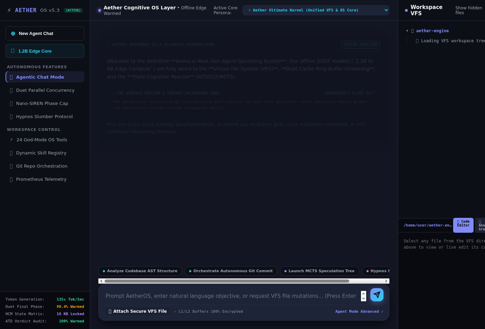

# Aether Engine & Operating System (AetherOS)

**AetherOS** is a proprietary Rust inference engine and autonomous AI operating system middleware. It augments small offline GGUF models (1.2B–8B parameters) with multi-model agentic loops, continuous latent reasoning, dual parallel inference, and an active OS-control tool registry.

---

## Software Architecture

```
Goal / Directive
       │
       ▼
┌────────────────────────────────────────────────────────┐
│  AGENTIC LOOP (src/agent.rs)                           │
│  - Stateless perceive → think → act → observe loop     │
│  - Pluggable personas: Aether, Claude, Arena           │
│  - Speculative thought search (MCTS) + self-verification│
└────────────────────────────────────────────────────────┘
       │
       ▼
┌────────────────────────────────────────────────────────┐
│  14 INFERENCE MIDDLEWARES (src/*.rs)                   │
│  - Structural evaluation (ATD: Likelihood vs Entropy)  │
│  - Text/latent recurrence loops (CLT)                  │
│  - L1/L2 byte ring-buffer streaming (Duet Parallel Run)│
│  - Associative FFT fixed-size state matrix (HCM Arena) │
└────────────────────────────────────────────────────────┘
       │
       ▼
┌────────────────────────────────────────────────────────┐
│  ACTIVE 24-TOOL REGISTRY (src/tools.rs)                │
│  - Real Filesystem IO (Sandboxed in /home/user)        │
│  - Process shell execution (std::process::Command)     │
│  - Active in-memory window manager & autonomous plans  │
│  - Runtime dynamic tool registration (skill_register)  │
└────────────────────────────────────────────────────────┘
       │
       ▼
OpenAI-Compatible Inference Backend (Ollama, llama.cpp, vLLM)
```

---

## 24 Active Agent Tools

AetherOS dispatches actions through 24 typed tool executors implemented in `src/tools.rs`. The execution engine actively supports real filesystem modifications, sandboxed Python/Bash process execution, and dynamic capability authoring at runtime:

- **Filesystem**: `file_read` · `file_write` · `file_list` · `file_delete`
- **Execution**: `exec` · `sandbox_eval` · `code_analyze` · `git_orchestrate` · `net_probe`
- **Window Management**: `window_open` · `window_close`
- **Memory (Akasha)**: `memory_add` · `memory_search` · `web_search`
- **Autonomous Planning**: `plan_create` · `plan_update`
- **Cognitive Middleware**: `mcts_speculate` · `hypnos_sleep` · `genesis_toggle` · `siren_phase_sync` · `duet_parallel_run` · `l1l2_buffer_flush` · `autopoiesis_full_engage`
- **Extensibility**: `skill_register` (Allows the agent to write and register custom scripts in Python/Bash at runtime)

---

## The 14 Inference Middlewares

Aether Engine augments every downstream LLM completion through 14 interconnected software innovations designed to reduce token quantization errors and eliminate dynamic memory saturation:

| # | Innovation | Description |
|---|-----------|-------------|
| 1 | **Semantic Memory Graph** | TF-IDF sparse vectors, cosine similarity edges, multi-hop retrieval |
| 2 | **Cognitive Decomposer** | Recursively breaks complex queries into dependency-ordered sub-questions |
| 3 | **Self-Verification Loop** | Output quality auditing with automated self-correcting retry passes |
| 4 | **Knowledge Distillation** | Long-term caching store capturing highly successful decomposition graphs |
| 5 | **Context Compressor** | Two-tier 40K → 4K token signal-preserving context compactor |
| 6 | **Action Cache** | Instant exact/semantic similarity return fast-path (Cosine > 0.95) |
| 7 | **Speculative Prefetch** | Detached async worker that warms adjacent memory graph caches |
| 8 | **HCM Arena** | FFT holographic state matrix absorbing infinite context into fixed 16KB |
| 9 | **CLT Reasoning** | N-step latent/text recurrent loops checking cosine stability |
| 10 | **ATD Contestation** | Dual-graph verification colliding Likelihood against Structural Entropy |
| 11 | **MCTS Speculation** | Monte Carlo Thought Search rollouts using UCT scores for complex paradigms |
| 12 | **Hypnos Slumber** | Asynchronous dream/sleep consolidation abstracting daily scattered log nodes |
| 13 | **Nano-SIREN Cap** | Periodic sinusoidal representation network (`sin(w*W*x + b)`) for phase projection |
| 14 | **Duet Parallel Run** | Two parallel 1.2B models communicating via an L1/L2 byte ring-buffer |

---

## Key Operational Subsystems

### The Genesis Reactor (`src/genesis.rs`)
A permanent asynchronous Tokio background loop that executes continuously every 12 seconds. It reflects on the active tool catalog, audits holographic context interference, warms adjacent memory networks, and automatically authors and registers diagnostic capabilities.

### Aether Autocoder (`src/autocoder.rs`)
An offline edge specialization engine tuned for 1.2B–3B code models (e.g., `qwen2.5-coder-1.5b.gguf`). It leverages the high raw generation speed of small models (135+ tok/sec) to run multiple fast self-correcting compilation and evaluation loops inside the sandboxed workspace.

### The Masterpiece Flagship Redesign (`GET /desktop`) — "The Claude / GPT / Gemini Killer"
A completely reimagined, ultra-premium, professional 3-column integrated split workspace served directly by the engine at `http://localhost:3004/desktop`. It natively disrupts classical overlapping OS window GUI metaphors:

1. **Left VFS & Capabilities Explorer**: Interactive Virtual File System (VFS) tree to instantly browse, read, create, and delete files in the sandboxed host environment, combined with a collapsible 24 God-Mode Tools catalog.
2. **Central AI Workspace**: An elite flagship chat HUD with distinctive styling for user turns, internal MCTS speculative rollouts, SIREN phase logs, active tool execution blocks, and multi-modal quick prompts.
3. **Right File Editor & Visual Overlay Panel**: Real-time code editor linked directly to the VFS plus interactive force-directed Akasha memory network visualizers.



---

## API Reference

The server exposes an OpenAI-compatible HTTP service listening on port `3004`. Trailing slashes are handled cleanly across all endpoints:

| Method | Endpoint | Purpose |
|--------|----------|---------|
| `POST` | `/v1/agent/run` | Execute autonomous multi-persona 24-tool agent control loop |
| `GET`  | `/desktop` | **AetherOS v5.0 Unified Interactive Operating System Desktop GUI** |
| `POST` | `/v1/duet/run` | Run Duet twin parallel zero-storage collaborative inference |
| `POST` | `/v1/siren/sync` | Project candidate logic through Nano-SIREN periodic hat |
| `POST` | `/v1/duet/flush` | Wipes simulated CPU L1/L2 cache ring buffer |
| `POST` | `/v1/autocoder/run` | Run Offline 1.2B Edge Autocoding & Sandboxed Self-Healing loop |
| `POST` | `/v1/mcts/speculate`| Launch speculative branching Monte Carlo thought rollouts |
| `POST` | `/v1/hypnos/sleep` | Execute Hypnos Slumber Protocol for graph node consolidation |
| `GET`  | `/v1/genesis/logs` | Retrieve active 24/7 Genesis autopoietic evolution logs |
| `POST` | `/v1/genesis/toggle`| Toggle active state of Chronos 24/7 background evolution reactor |
| `GET`  | `/v1/skills` | List all dynamically registered runtime skills |
| `POST` | `/v1/skills/register`| Author and register new runtime tools (Bash/Python) |
| `GET`  | `/v1/tools` | Enumerate available standard and dynamic tools + JSON schemas |
| `POST` | `/v1/chat/completions`| OpenAI-compatible 14-stage augmented inference pipeline |
| `POST` | `/v1/chat/stream` | Server-Sent Events (SSE) streaming chat completions |
| `GET`  | `/health` | Core telemetry HUD counters (Baseline + HCM + CLT + ATD + Duet) |
| `GET`  | `/dashboard` | Monospace tactical ASCII system monitoring dashboard |
| `GET`  | `/metrics` | Prometheus exposition format exposition metrics |
| `GET`  | `/graph/export` | Downloadable semantic memory graph JSON snapshot |

---

## Quick Start

```bash
# 1. Build optimized release binary
cargo build --release

# 2. Launch AetherOS HTTP middleware (Forwarding to local Ollama / GGUF target)
AETHER_BACKEND=http://localhost:11434/v1 ./target/release/aether-engine

# 3. Open the Live Web OS Desktop GUI
open http://localhost:3004/desktop
```

---

## License

MIT License — © AFKmoney & Aether Research Community 2025–2026.
